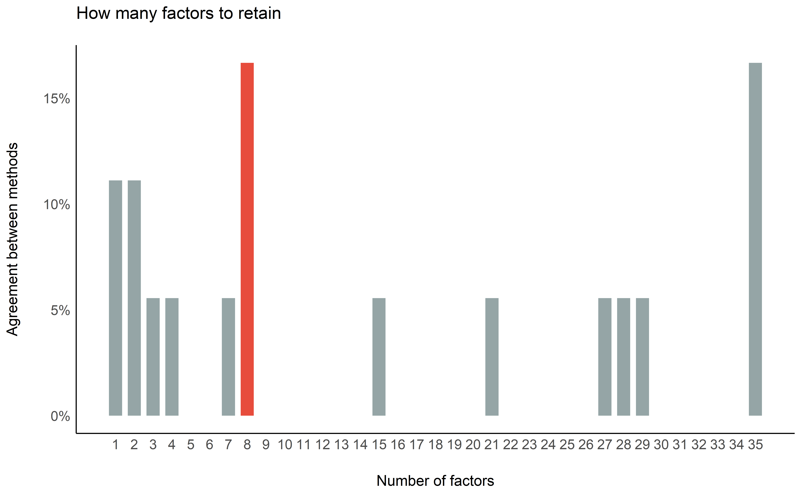
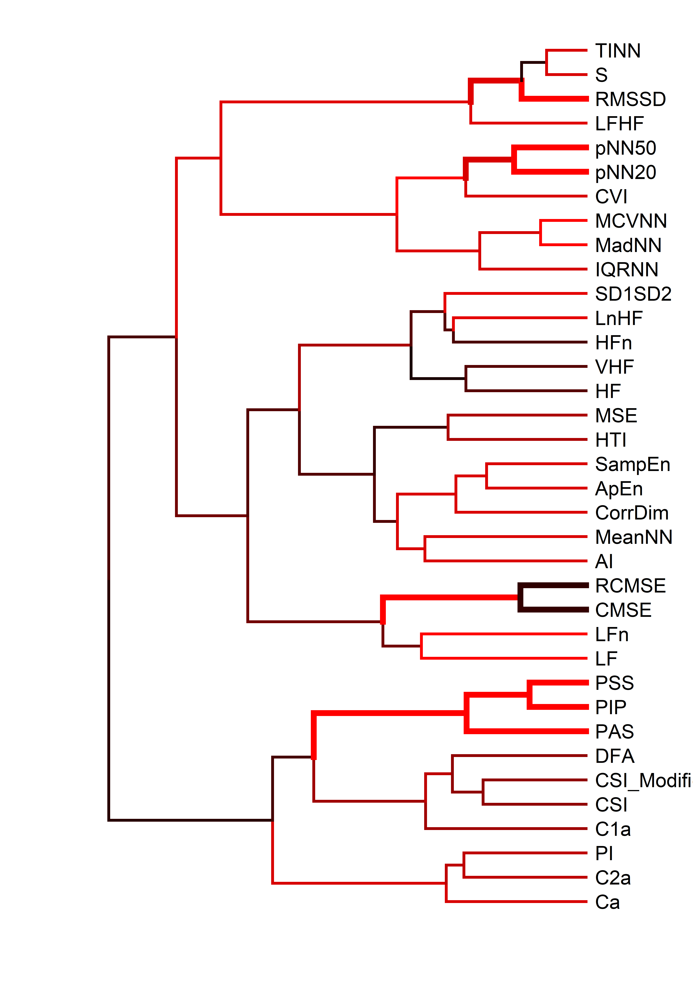

<!-- 
!!!! IMPORTANT: run `source("utils/render.R")` to publish instead of clicking on 'Knit'
-->

# Unveiling the Structure of Heart Rate Variability (HRV) Indices: A Data-driven Meta-clustering Approach

[](https://github.com/Tam-Pham/HRVStructure)
[](https://realitybending.github.io/TemplateResults/)
[](https://github.com/RealityBending/TemplateResults/raw/main/word_and_pdf/SupplementaryMaterials.docx)
[](https://github.com/RealityBending/TemplateResults/blob/main/word_and_pdf/SupplementaryMaterials.pdf)

## Introduction

Heart Rate Variability (HRV) can be estimated using a myriad of mathematical indices, but the lack of systematic comparison between these indices renders the
interpretation and evaluation of results tedious. In this study, we assessed the relationship between 57 HRV metrics collected from 302 human recordings using a
variety of structure-analysis algorithms. We then applied a meta-clustering approach that combines their results to obtain a robust and reliable view of the observed
relationships. We found that HRV metrics can be clustered into 3 groups, representing the distribution-related features, harmony-related features and
frequency/complexity features. From there, we described and discussed their associations, and derived recommendations on which indices to prioritize for parsimonious,
yet comprehensive HRV-related data analysis and reporting.

## Databases

### Glasgow University Database

The GUDB Database (**howell2018high**) contains ECGs from 25 subjects.
Each subject was recorded performing 5 different tasks for two minutes
(sitting, doing a maths test on a tablet, walking on a treadmill,
running on a treadmill, using a hand bike). The sampling rate is 250Hz
for all the conditions.

The script to download and format the database using the
[**ECG-GUDB**](https://github.com/berndporr/ECG-GUDB) Python package by
Bernd Porr can be found
[**here**](https://github.com/neuropsychology/NeuroKit/blob/dev/data/gudb/download_gudb.py).

### MIT-BIH Arrhythmia Database

The MIT-BIH Arrhythmia Database \[MIT-Arrhythmia;
(**moody2001impact?**)\] contains 48 excerpts of 30-min of two-channel
ambulatory ECG recordings sampled at 360Hz and 25 additional recordings
from the same participants including common but clinically significant
arrhythmias (denoted as the `MIT-Arrhythmia-x` database).

The script to download and format the database using the can be found
[**here**](https://github.com/neuropsychology/NeuroKit/blob/dev/data/mit_arrhythmia/download_mit_arrhythmia.py).

### MIT-BIH Normal Sinus Rhythm Database

This database includes 18 clean long-term ECG recordings of subjects.
Due to memory limits, we only kept the second hour of recording of each
participant.

The script to download and format the database using the can be found
[**here**](https://github.com/neuropsychology/NeuroKit/blob/dev/data/mit_normal/download_mit_normal.py).

<!-- ### Lobachevsky University Electrocardiography Database -->
<!-- The Lobachevsky University Electrocardiography Database [LUDB; @kalyakulina2018lu] consists of 200 10-second 12-lead ECG signal records representing different morphologies of the ECG signal. The ECGs were collected from healthy volunteers and patients, which had various cardiovascular diseases. The boundaries of P, T waves and QRS complexes were manually annotated by cardiologists for all 200 records. -->

### Fantasia Database

The Fantasia database (**iyengar1996age?**) consists of twenty young and
twenty elderly healthy subjects. All subjects remained in a resting
state in sinus rhythm while watching the movie Fantasia (Disney, 1940)
to help maintain wakefulness. The continuous ECG signals were digitized
at 250 Hz. Each heartbeat was annotated using an automated arrhythmia
detection algorithm, and each beat annotation was verified by visual
inspection.

## Procedure

## Results

``` r
library(tidyverse)
library(easystats)

data <- read.csv("data/data.csv", stringsAsFactors = FALSE) %>% 
  select(-HRV_ULF, -HRV_VLF) %>%  # Empty
  filter(Database != "LUDB") # too short recordings, many indices didn't converge
names(data) <- stringr::str_remove(names(data), "HRV_")
```

### Redundant Indices

#### Remove Equivalent (r higher than .995)

``` r
data %>% 
  correlation::correlation() %>% 
  filter(abs(r) > 0.995) %>% 
  arrange(Parameter1, desc(abs(r)))
```

    > Parameter1 | Parameter2 |     r |         95% CI |    t(250) |      p |  Method | n_Obs
    > ---------------------------------------------------------------------------------------
    > C1d        |        C1a | -1.00 | [-1.00, -1.00] | -1.06e+09 | < .001 | Pearson |   252
    > C2d        |        C2a | -1.00 | [-1.00, -1.00] |      -Inf | < .001 | Pearson |   252
    > Cd         |         Ca | -1.00 | [-1.00, -1.00] |      -Inf | < .001 | Pearson |   252
    > RMSSD      |       SDSD |  1.00 | [ 1.00,  1.00] |  49985.56 | < .001 | Pearson |   252
    > RMSSD      |        SD1 |  1.00 | [ 1.00,  1.00] |  49985.56 | < .001 | Pearson |   252
    > RMSSD      |       SD1d |  1.00 | [ 1.00,  1.00] |    536.98 | < .001 | Pearson |   252
    > RMSSD      |       SD1a |  1.00 | [ 1.00,  1.00] |    466.36 | < .001 | Pearson |   252
    > SD1        |       SD1d |  1.00 | [ 1.00,  1.00] |    537.53 | < .001 | Pearson |   252
    > SD1        |       SD1a |  1.00 | [ 1.00,  1.00] |    465.97 | < .001 | Pearson |   252
    > SD1d       |       SD1a |  1.00 | [ 1.00,  1.00] |    249.46 | < .001 | Pearson |   252
    > SD2        |       SD2a |  1.00 | [ 1.00,  1.00] |    289.38 | < .001 | Pearson |   252
    > SD2        |       SD2d |  1.00 | [ 1.00,  1.00] |    201.76 | < .001 | Pearson |   252
    > SDNN       |      SDNNa |  1.00 | [ 1.00,  1.00] |    727.31 | < .001 | Pearson |   252
    > SDNN       |      SDNNd |  1.00 | [ 1.00,  1.00] |    578.75 | < .001 | Pearson |   252
    > SDNNd      |      SDNNa |  1.00 | [ 1.00,  1.00] |    324.46 | < .001 | Pearson |   252
    > SDSD       |        SD1 |  1.00 | [ 1.00,  1.00] |       Inf | < .001 | Pearson |   252
    > SDSD       |       SD1d |  1.00 | [ 1.00,  1.00] |    537.53 | < .001 | Pearson |   252
    > SDSD       |       SD1a |  1.00 | [ 1.00,  1.00] |    465.97 | < .001 | Pearson |   252
    > 
    > p-value adjustment method: Holm (1979)

``` r
data <- data %>% 
  select(-SDSD, -SD1, -SD1d, -SD1a, -CVSD) %>%  # Same as RMSSD 
  select(-SDNNd, -SDNNa) %>%  # Same as SDNN
  select(-SD2d, -SD2a) %>%   # Same as SD2
  select(-Cd) %>%   # Same as Ca
  select(-C1d, -C2d) # Same as C1a and C2a
```

#### Remove Strongly Correlated (r higher than .98)

``` r
data %>% 
  correlation::correlation() %>% 
  filter(abs(r) > 0.95) %>%
  arrange(Parameter1, desc(abs(r)))
```

    > Parameter1 | Parameter2 |    r |       95% CI | t(250) |      p |  Method | n_Obs
    > ---------------------------------------------------------------------------------
    > CVNN       |        SD2 | 0.97 | [0.96, 0.98] |  64.63 | < .001 | Pearson |   252
    > GI         |         AI | 0.99 | [0.99, 0.99] | 138.11 | < .001 | Pearson |   252
    > GI         |         SI | 0.99 | [0.99, 0.99] | 115.38 | < .001 | Pearson |   252
    > MeanNN     |   MedianNN | 0.99 | [0.98, 0.99] |  99.44 | < .001 | Pearson |   252
    > PIP        |       IALS | 0.98 | [0.98, 0.99] |  86.82 | < .001 | Pearson |   252
    > RMSSD      |       SDNN | 0.98 | [0.98, 0.99] |  79.71 | < .001 | Pearson |   252
    > RMSSD      |       CVNN | 0.97 | [0.96, 0.98] |  62.71 | < .001 | Pearson |   252
    > SDNN       |        SD2 | 0.99 | [0.99, 0.99] | 119.74 | < .001 | Pearson |   252
    > SDNN       |       CVNN | 0.98 | [0.98, 0.99] |  88.51 | < .001 | Pearson |   252
    > SI         |         AI | 0.97 | [0.96, 0.98] |  62.76 | < .001 | Pearson |   252
    > TINN       |          S | 0.95 | [0.94, 0.96] |  50.54 | < .001 | Pearson |   252
    > 
    > p-value adjustment method: Holm (1979)

``` r
data <- data %>% 
  select(-GI, -SI) %>%  # Same as AI 
  select(-SD2) %>%  # Same as SDNN
  select(-MedianNN) %>%  # Same as MeanNN
  select(-IALS) %>%  # Same as PIP
  select(-SDNN, -CVNN) # Same as RMSSD
```

### Recording Length

#### Investigate effect

``` r
correlation(data) %>% 
  filter(Parameter2 == "Recording_Length") %>% 
  arrange(desc(abs(r)))
```

#### Adjust the data for recording length

``` r
data <- effectsize::adjust(data, effect="Recording_Length") %>% 
  select(-Recording_Length)
```

### Gaussian Graphical Model

``` r
library(ggraph)

data %>% 
  correlation::correlation(partial=FALSE) %>% 
  correlation::cor_to_pcor() %>% 
  filter(abs(r) > 0.2) %>%
  tidygraph::as_tbl_graph(directed=FALSE) %>% 
  dplyr::mutate(closeness = tidygraph::centrality_closeness(normalized = TRUE),
                degree = tidygraph::centrality_degree(normalized = TRUE),
                betweeness = tidygraph::centrality_betweenness(normalized = TRUE)) %>%
  tidygraph::activate(nodes) %>%
  dplyr::mutate(group1 = as.factor(tidygraph::group_edge_betweenness()),
                # group2 = as.factor(tidygraph::group_optimal()),
                # group3 = as.factor(tidygraph::group_walktrap()),
                # group4 = as.factor(tidygraph::group_spinglass()),
                group5 = as.factor(tidygraph::group_louvain())) %>% 
  ggraph::ggraph(layout = "fr") +
    ggraph::geom_edge_arc(aes(colour = r, edge_width = abs(r)), strength = 0.1, show.legend = FALSE) +
    ggraph::geom_node_point(aes(size = degree, color = group5), show.legend = FALSE) +
    ggraph::geom_node_text(aes(label = name), colour = "white") +
    ggraph::scale_edge_color_gradient2(low = "#a20025", high = "#008a00", name = "r") +
    ggraph::theme_graph() +
    guides(edge_width = FALSE) +
    scale_x_continuous(expand = expansion(c(.10, .10))) +
    scale_y_continuous(expand = expansion(c(.10, .10))) +
    scale_size_continuous(range = c(20, 30)) +
    scale_edge_width_continuous(range = c(0.5, 2)) +
    see::scale_color_material_d(palette="rainbow", reverse=TRUE)
```


Groups were identified using the
[tidygraph::group_optimal](https://rdrr.io/cran/tidygraph/man/group_graph.html)
algorithm.

### Factor Analysis

#### How many factors

``` r
cor <- correlation::correlation(data[sapply(data, is.numeric)]) %>% 
  as.matrix()

n <- parameters::n_factors(data, cor=cor)

n
```

    > # Method Agreement Procedure:
    > 
    > The choice of 8 dimensions is supported by 3 (16.67%) methods out of 18 (Optimal coordinates, Parallel analysis, Kaiser criterion).

``` r
plot(n) +
  see::theme_modern()
```



#### Exploratory Factor Analysis (EFA)

``` r
efa <- parameters::factor_analysis(data, cor=cor, n=7, rotation="varimax", fm="ml")

print(efa, threshold="max", sort=TRUE)
```

    > # Rotated loadings from Factor Analysis (varimax-rotation)
    > 
    > Variable     |  ML4  | ML1  | ML3  |  ML2  |  ML7  | ML5  | ML6  | Complexity | Uniqueness
    > ------------------------------------------------------------------------------------------
    > SD1SD2       | 0.86  |      |      |       |       |      |      |    1.28    |    0.17   
    > DFA          | -0.79 |      |      |       |       |      |      |    1.24    |    0.31   
    > CSI          | -0.77 |      |      |       |       |      |      |    2.06    |    0.06   
    > LnHF         | 0.72  |      |      |       |       |      |      |    2.22    |    0.20   
    > HFn          | 0.66  |      |      |       |       |      |      |    1.47    |    0.46   
    > CSI_Modified | -0.64 |      |      |       |       |      |      |    3.47    |    0.12   
    > LFn          | -0.62 |      |      |       |       |      |      |    1.67    |    0.49   
    > C1a          | -0.56 |      |      |       |       |      |      |    1.71    |    0.57   
    > HF           | 0.55  |      |      |       |       |      |      |    1.22    |    0.67   
    > VHF          | 0.54  |      |      |       |       |      |      |    1.47    |    0.65   
    > HTI          | 0.35  |      |      |       |       |      |      |    2.12    |    0.78   
    > MCVNN        |       | 0.97 |      |       |       |      |      |    1.12    |  4.99e-03 
    > MadNN        |       | 0.96 |      |       |       |      |      |    1.06    |    0.05   
    > IQRNN        |       | 0.81 |      |       |       |      |      |    1.15    |    0.29   
    > pNN50        |       | 0.65 |      |       |       |      |      |    3.08    |    0.11   
    > CVI          |       | 0.61 |      |       |       |      |      |    3.93    |    0.02   
    > pNN20        |       | 0.55 |      |       |       |      |      |    3.90    |    0.05   
    > S            |       |      | 0.99 |       |       |      |      |    1.00    |    0.02   
    > TINN         |       |      | 0.97 |       |       |      |      |    1.03    |    0.04   
    > RMSSD        |       |      | 0.92 |       |       |      |      |    1.30    |    0.03   
    > LFHF         |       |      | 0.79 |       |       |      |      |    1.45    |    0.25   
    > PIP          |       |      |      | 0.99  |       |      |      |    1.02    |  4.87e-03 
    > PSS          |       |      |      | 0.94  |       |      |      |    1.03    |    0.11   
    > PAS          |       |      |      | 0.79  |       |      |      |    1.46    |    0.24   
    > LF           |       |      |      | -0.40 |       |      |      |    2.79    |    0.68   
    > RCMSE        |       |      |      |       | -0.67 |      |      |    2.49    |    0.21   
    > CMSE         |       |      |      |       | -0.67 |      |      |    2.38    |    0.26   
    > C2a          |       |      |      |       | 0.58  |      |      |    1.91    |    0.49   
    > AI           |       |      |      |       | -0.57 |      |      |    2.48    |    0.31   
    > PI           |       |      |      |       | 0.54  |      |      |    1.68    |    0.62   
    > Ca           |       |      |      |       | 0.51  |      |      |    1.51    |    0.67   
    > SampEn       |       |      |      |       |       | 0.74 |      |    2.38    |    0.09   
    > ApEn         |       |      |      |       |       | 0.73 |      |    1.88    |    0.24   
    > CorrDim      |       |      |      |       |       | 0.68 |      |    2.22    |    0.27   
    > MSE          |       |      |      |       |       | 0.41 |      |    2.00    |    0.75   
    > MeanNN       |       |      |      |       |       |      | 0.64 |    2.25    |    0.37   
    > 
    > The 7 latent factors (varimax rotation) accounted for 70.43% of the total variance of the original data (ML4 = 17.93%, ML1 = 10.90%, ML3 = 10.87%, ML2 = 10.17%, ML7 = 9.55%, ML5 = 7.45%, ML6 = 3.57%).

``` r
plot(efa) +
  see::theme_modern()
```


#### Confirmatory Factor Analysis (CFA)

``` r
library(lavaan)

model <- parameters::efa_to_cfa(efa, threshold = "max")
cfa <- lavaan::cfa(model, data=data) %>%
  parameters::parameters(standardize=TRUE)
```

    > Error in if (ncol(S) == 1L) { : argument is of length zero

``` r
cfa
```

    > # Loading
    > 
    > Link                | Coefficient |      p
    > ------------------------------------------
    > ML4 =~ HTI          |        0.91 | < .001
    > ML4 =~ HF           |       -1.00 | < .001
    > ML4 =~ VHF          |       -1.00 | < .001
    > ML4 =~ LFn          |       -1.00 | < .001
    > ML4 =~ HFn          |       -1.00 | < .001
    > ML4 =~ LnHF         |       -1.00 | < .001
    > ML4 =~ SD1SD2       |       -1.00 | < .001
    > ML4 =~ CSI          |       -1.00 | < .001
    > ML4 =~ CSI_Modified |        1.00 | < .001
    > ML4 =~ C1a          |       -1.00 | < .001
    > ML4 =~ DFA          |       -1.00 | < .001
    > ML1 =~ MadNN        |        0.96 | < .001
    > ML1 =~ MCVNN        |       -1.00 | < .001
    > ML1 =~ IQRNN        |       -1.00 | < .001
    > ML1 =~ pNN50        |       -1.00 | < .001
    > ML1 =~ pNN20        |       -1.00 | < .001
    > ML1 =~ CVI          |       -1.00 | < .001
    > ML3 =~ RMSSD        |        0.72 | < .001
    > ML3 =~ TINN         |        0.86 | < .001
    > ML3 =~ LFHF         |    8.53e-04 | < .001
    > ML3 =~ S            |        1.00 | < .001
    > ML2 =~ LF           |        0.83 | < .001
    > ML2 =~ PIP          |       -1.00 | < .001
    > ML2 =~ PSS          |       -1.00 | < .001
    > ML2 =~ PAS          |       -1.00 | < .001
    > ML7 =~ AI           |        0.85 | < .001
    > ML7 =~ PI           |        1.00 | < .001
    > ML7 =~ C2a          |        1.00 | < .001
    > ML7 =~ Ca           |        1.00 | < .001
    > ML7 =~ CMSE         |        1.00 | < .001
    > ML7 =~ RCMSE        |        1.00 | < .001
    > ML5 =~ ApEn         |        0.80 | < .001
    > ML5 =~ SampEn       |       -0.90 | < .001
    > ML5 =~ MSE          |        0.82 | < .001
    > ML5 =~ CorrDim      |       -0.06 | < .001
    > ML6 =~ MeanNN       |        1.00 | < .001
    > 
    > # Correlation
    > 
    > Link       | Coefficient |      p
    > ---------------------------------
    > ML4 ~~ ML1 |        0.39 | < .001
    > ML4 ~~ ML3 |       -0.07 | < .001
    > ML4 ~~ ML2 |        0.76 | < .001
    > ML4 ~~ ML7 |        0.39 | < .001
    > ML4 ~~ ML5 |       -0.66 | < .001
    > ML4 ~~ ML6 |       -0.06 | < .001
    > ML1 ~~ ML3 |       -0.03 | < .001
    > ML1 ~~ ML2 |        0.46 | < .001
    > ML1 ~~ ML7 |        0.48 | < .001
    > ML1 ~~ ML5 |       -0.89 | < .001
    > ML1 ~~ ML6 |       -0.47 | < .001
    > ML3 ~~ ML2 |       -0.07 | < .001
    > ML3 ~~ ML7 |       -0.01 | < .001
    > ML3 ~~ ML5 |        0.05 | < .001
    > ML3 ~~ ML6 |   -7.85e-03 | < .001
    > ML2 ~~ ML7 |        0.33 | < .001
    > ML2 ~~ ML5 |       -0.64 | < .001
    > ML2 ~~ ML6 |        0.04 | < .001
    > ML7 ~~ ML5 |       -0.42 | < .001
    > ML7 ~~ ML6 |       -0.32 | < .001
    > ML5 ~~ ML6 |        0.42 | < .001

``` r
plot(cfa)
```


### Cluster Analysis

#### How many clusters

``` r
dat <- effectsize::standardize(data[sapply(data, is.numeric)])

n <- parameters::n_clusters(t(dat), package = c("mclust", "cluster"))

n
```

    > # Method Agreement Procedure:
    > 
    > The choice of 1 clusters is supported by 1 (50.00%) methods out of 2 (Tibs2001SEmax).

``` r
plot(n) +
  theme_modern()
```


``` r
library(dendextend)

dat <- effectsize::standardize(data[sapply(data, is.numeric)])

result <- pvclust::pvclust(dat, method.dist="euclidean", method.hclust="ward.D2", nboot=10, quiet=TRUE)

result %>% 
  as.dendrogram() %>% 
  sort() %>% 
  dendextend::pvclust_show_signif_gradient(result, signif_col_fun = grDevices::colorRampPalette(c("black", "red"))) %>% 
  dendextend::pvclust_show_signif(result, signif_value = c(2, 1)) %>%
  dendextend::as.ggdend() %>% 
  ggplot2::ggplot(horiz=TRUE, offset_labels = -1)
```



## References
