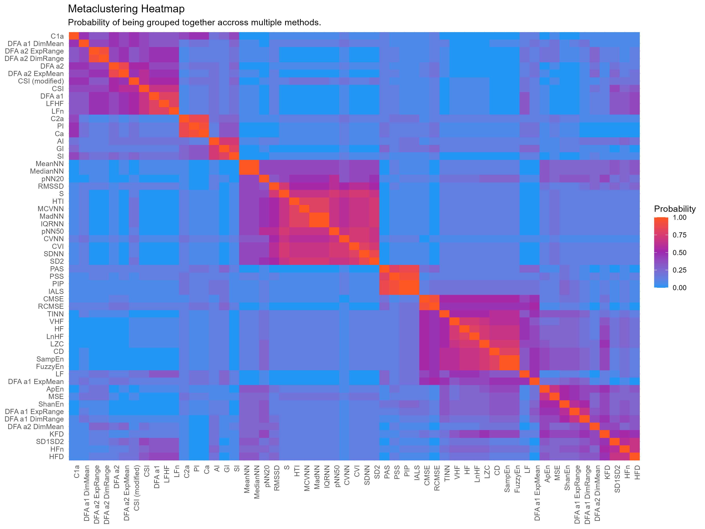

\justify
```{r r_setup, include = FALSE, warning=FALSE, message=FALSE}
library("papaja")
library("kableExtra")
library("tidyverse")
options(knitr.kable.NA = 'None')
```

<!-- introduce hrv -->

Heart Rate Variability (HRV), reflecting the heart's ability to effectively regulate and adapt to internal and external environmental changes, has been linked to many physical and mental health outcomes [e.g., cardiac complications, @laitio2007role, diabetes, @kudat2006heart, mood disorders, @bassett2016literature, cognitive functioning, @forte2019heart]. Conventionally, the various indices used in the assessment of HRV are broadly categorized based on their mathematical underpinnings, with categories traditionally including the *time-domain*, *frequency-domain*, and *nonlinear dynamics*.


<!-- main categories -->

Time-domain indices are overall the simplest and most straightforward method of quantifying the variability of normal (i.e., excluding abnormal beats such as ectopic beats) heartbeat intervals (NN intervals - NNIs). Some commonly derived indices include *SDNN*, the standard deviation of all NN intervals, *RMSSD*, the root mean square of the sum of successive differences of NN intervals, and *pNN50*, the percentage of adjacent NN intervals separated by more than 50ms. While time-domain methods offer computational ease, they are less sensitive to distinguish between the contributions of sympathetic and parasympathetic branches [@acharya2006heart]. Frequency-domain indices, on the other hand, target the assessment of these different regulatory mechanisms by investigating how the HRV power spectrum distributes across different frequency bands (e.g, low frequency, *LF* or high frequency, *HF*). Other indices that fall under the frequency domain include derivatives of the aforementioned components, such as the ratio of *LF* to *HF* (*LF/HF*) power and their normalized (e.g., *LFn*, *HFn*) and natural logarithmic variants (e.g., *LnHF*). Finally, drawn from concepts of non-linear dynamics and chaos theory [@golberger1996non; @lau2021brain
], non-linear indices were introduced to better characterize the complex physiological mechanisms underlying HRV. Prominent indices include measures obtained from a Poincaré plot where an ellipse is fitted to a scatterplot of each NN interval against its preceding one [e.g., the standard deviation of the short-term, *SD1* and long-term, *SD2* NN interval variability, as well as its corresponding ratio, *SD1/SD2*, @brennan2001existing]. Other non-linear indices that fall under this category, such as Detrended Fluctuation Analysis (*DFA*), multi-fractal *DFA* (*MF-DFA*) and correlation dimension (*CD*), account for the fractal properties of HRV, while entropy measures like approximate entropy (*ApEn*), sample entropy (*SampEn*), and multiscale entropy (*MSE*) quantify the amount of regularity in the heart rate (HR)  time series [@voss2009methods]. However, new methods are continually being developed, including time-frequency domain analysis [@faust2004analysis] and HR fragmentation [@costa2017heart]. For a more comprehensive description of all HRV indices, see @pham2021heart.


<!-- overlap and duplicates in indices, aim of study -->

In light of the popularity of HRV analysis for investigating health and disease, the multitude of existing metrics warrants some concerns. Firstly, the functional association of these indices with physiological mechanisms is poorly understood [@fatisson2016influence; @hayano2019pitfalls], with the indices often used interchangeably to describe HRV as a general concept. This not only makes it difficult to interpret and report the complex patterns of (sometimes inconsistent) results but can also aggravate replicability issues, as different studies, when examining the same phenomenon (e.g., cognitive flexibility, ageing), might rely on different indices to describe the relationships with HRV. Apart from this conceptual hurdle pertaining to the unclear relationship between the mathematical indices and their physiological meaning, another pragmatic issue lies in the shared similarities and overlaps between many of these metrics.  For instance, early studies have investigated the relationships between time-domain and frequency-domain indices, showing that not only were *RMSSD* and *pNN50* strongly correlated with each other [above 0.9, @bigger1989comparison], they were also highly associated with *HF* power [@bigger1989comparison; @kleiger2005heart; @otzenberger1998dynamic], suggesting that these measures could be treated as surrogates for each other in assessing the parasympathetic modulation of HRV. This observation is warranted given that the former is computed from the differences across consecutive NN intervals, and hence, they reflect mainly high-frequency oscillatory patterns in HR and are independent of long-term changes. On the other hand, *SDNN*, which has been thought to reflect both sympathetic and parasympathetic activity, is correlated to total power in the HRV power spectrum [@bigger1989comparison]. Recent years also witnessed the emergence of debates regarding the traditional conceptualization of *SD1* and *SD2* as non-linear indices, particularly when @ciccone2017reminder pointed out that *RMSSD* and *SD1* are actually mathematically equivalent. Consequently, studies that report both of these short-term HRV indices often independently arrive at identical statistical results without addressing this equivalence [e.g., @rossi2015impact, @peng2015extraction, @leite2015correlation]. Additionally, other studies have also drawn similarities between *SD1/SD2* and *LF/HF* in their indexing of the balance between short- and long-term HRV [@brennan2002poincare; @guzik2007correlations]. These overlaps, if not taken into account in analyses, can lead to statistical issues, such as inflated confidence in the results (shown by an artificially high number of indices seemingly agreeing with a given trend), collinearity issues (if multiple indices are jointly used as predictors), potential over-correction (e.g., for Bonferroni-type p-value adjustment methods), and needlessly complex and cluttered patterns of results [@naes2001understanding; @mela2002impact; @dormann2013collinearity].

The aim of this study is thus to increase the understanding of the relationships between HRV indices using a data-driven approach. Beyond simply computing and reporting the correlations between the indices, the goal is to assess the presence of groups (i.e., clusters) of metrics, subsequently describe them, and discuss hypotheses as to their existence. While there exist different approaches to assign data to different groups based on their level of associations [see @nguyen2019improving], there is no gold standard or clear guidelines to determine the most appropriate method for grouping these physiological indices. As such, choosing one method and presenting its solution as a definitive one can be misleading. Thus, we will explore the structure of HRV indices using a consensus-based methodology [@kuncheva2014combining; @monti2003consensus; @bhattacharjee2001classification], henceforth referred to as *meta-clustering*, where the results of multiple structure analysis approaches are systematically combined to highlight the most robust associations between HRV indices.


# Methods

The electrocardiogram (ECG) data of 302 participants were extracted from 6 open-access databases described below. The script to download and format the databases are available at https://github.com/neuropsychology/NeuroKit/data/ The processed data, as well as the full reproducible analysis script, including additional descriptions of each approach and the solutions of each individual clustering method, are available at this GitHub repository (<https://github.com/Tam-Pham/HRVStructure>).


## Databases

The Glasgow University Database (GUDB) database [@howell2018high] contains ECG recordings from 25 healthy participants (\> 18 years old) performing five different two-minute tasks (sitting, doing a maths test on a tablet, walking on a treadmill, running on a treadmill, using a handbike). All recordings were sampled at 250 Hz.

The MIT-BIH Arrhythmia Database (MIT-Arrhythmia and MIT-Arrhythmia-x) database [@moody2001impact] contains 48 ECG recordings (25 men, 32-89 years old; 22 women, 23-89 years old) from a mixed population of patients. All recordings were sampled at 360 Hz and lasted for 30 minutes.

The Fantasia database [@iyengar1996age] contains ECG recordings from 20 young (21-34 years old) and 20 elderly (68-85 years old) healthy participants. All participants remained in a resting state in sinus rhythm while watching the movie Fantasia (Disney, 1940) that helped to maintain wakefulness. All recordings were sampled at 250 Hz and lasted for 120 minutes.

The MIT-BIH Normal Sinus Rhythm Database (MIT-Normal) database [@goldberger2000physiobank] contains long-term ($\approx$. 24h) ECG recordings from 18 participants (5 men, 26-45 years old; 13 women, 20-50 years old). All recordings were sampled at 128 Hz and due to memory limits, we kept only the second and third hours of each recording (with the loose assumption that the first hour might be less representative of the rest of the recording and a duration of 120 minutes to match those from Fantasia database).

The MIT-BIH Long-term ECG Database (MIT-Long-term) database [@goldberger2000physiobank] contains long-term (14 to 22 hours each) ECG recordings from 7 participants (6 men, 46-88 years old; 1 woman, 71 years old). All recordings were sampled at 128 Hz and due to memory limits, we kept only the second and third hours of each recording.

The last dataset came from resting-state <https://github.com/neuropsychology/RestingState> recordings of authors' other empirical studies. This dataset contains ECG recordings sampled at 4000 Hz from 43 healthy participants (\> 18 years old) that underwent 8 minutes of eyes-closed, seated position, resting state.

## Data Analysis

The `NeuroKit2` software [@makowski2021neurokit2] was used to preprocess the raw ECG signals (when available), locate R-peaks and subsequently compute all the HRV indices (see **Table 1** for he abbreviations and description of all HRV indices). The rest of the data analysis was carried out with R [@R-base] and the *easystats* ecosystem [@ludecke2019insight; @makowski2019bayestestr; @ludecke2021see; @makowski2020methods]. Reproducible scripts are available at <https://github.com/Tam-Pham/HRVStructure>.

We started by identifying indices that were near-perfect duplicates (\|r\| \> 0.999) and removed them (to prevent further statistical issues such as positive definite correlation matrices). For each index, we then removed extreme observations (\> .9999 percentile of the median absolute deviation from the median) - $\approx$ 4\% of data - using the `check_outliers` function in the *performance* R package [@ludecke2021performance]. On average, 5.61\% of data was detected as outliers and removed. Multiple structural methods were then applied to analyze the associations between the HRV indices, such as dimensionality analyses (including Principal Component Analysis - PCA, and Exploratory Factor Analysis - EFA), clustering (including k-means, k-medoids, hierarchical clustering, DBSCAN, HBSCAN, mixture model algorithms), as well as network-based approaches (exploratory graph analysis; EGA). While the individual solutions are described in the Supplementary Materials, the aim of the study was to aggregate them to identify the robust groups identified across these methods.

The *meta-clustering* approach [@ludecke2020extracting; which finds echoes in *consensus clustering*; see @monti2003consensus] treats the unique clustering solutions as an ensemble, from which a probability matrix is derived (see **Figure 1**). This matrix contains, for each pair of HRV indices, the probability of being grouped together. For instance, if two indices have been assigned to a similar cluster by 5 out of 10 clustering methods, then the probability associated with this pair is 0.5. This probability matrix is then treated as a distance matrix and submitted to hierarchical clustering. Essentially, this approach is based on the notion that, as each clustering algorithm embodies a different angle by which it sees the data, cross-validating the phenomenon of interest using different angles leads to more accurate results.

```{r Figure1, message=FALSE, warning=FALSE, fig.cap="Probability Matrix that represents the probability each pair of HRV indices being assigned to the same cluster", fig.align='center', echo=FALSE, out.width = "0.95\\textwidth", fig.pos = "!ht"}

```


# Results

Indices that were appeared as redundant in the correlation analysis, and subsequently removed, included 1) *SDSD*, *SD1*, *SD1a* and *SD1d* (duplicates of RMSSD); 2) *SDNNa* and *SDNNd* (duplicates of *SDNN*); 3) *SD2a* and *SD2d* (duplicates of *SD2*); 4) *Cd* (duplicate of *Ca*); 5) *C1d* (duplicate of *C1a*); and 6) *C2d* (duplicate of *C2a*). The indices that were kept were selected based on their higher popularity (e.g., *RMSSD*) or functional meaning (e.g., acceleration for *Ca*).

<!-- Dimension Reduction Approaches -->

PCA solutions with 9 and 12 components were deemed suitable [see the `n_components` function in the *parameters* package, @ludecke2020extracting] and extracted, and each component was treated as a cluster containing indices with the highest loadings. Following a similar optimizing procedure, two solutions of 9 factors and 12 factors were extracted using EFA. See **Tables 1-4** in *Supplementary Material* for the item loadings of dimension solutions.

<!-- Clustering Approaches -->

Three optimal structure solutions of 2-cluster, 7-cluster, and 10-cluster were identified for k-means clustering (see the `n_clusters` function in the *parameters* package) and a 3-cluster solution was extracted for k-medoids clustering [see `pamk` function, @hennig2015package]. Two hierarchical clustering models were also constructed using Euclidean distance method and average linkage method. These bootstrapping-based solutions to cluster selection with a confidence level of 90% and 95% identified 13 and 11 significant clusters respectively [see @suzuki2006pvclust]. Other unsupervised clustering approaches, DBSCAN and HDBSCAN, suggested two additional structure solutions of respectively 6 and 15 clusters, and the mixture model yielded a solution of 6 clusters. See **Figure 1-9** in *Supplementary Material* for the clustergrams/ deprograms results of clustering solutions.

<!-- Network-based approaches -->

Finally, two solutions were extracted from the network-based EGA approach using two network estimation algorithms, *GLASSO* and *TMFG*, in combination with the *louvian* network community detection algorithm [@golino2020eganet; @golino2020investigating]. The two networks were associated with structures of 7 and 6 clusters respectively. See **Figure 10-11** in *Supplementary Material* for the results of network solutions.

<!-- Meta-Clustering -->

Using the fifteen structure solutions from the aforementioned methods, we computed the probability matrix representing each pair of HRV indices being assigned to the same cluster (see **Figure 1**). The matrix was inverted to form a distance matrix and submitted to hierarchical cluster analysis with average linkage method. 
The results of the *meta-clustering* approach are presented in **Figure 2**. The most closely related clusters of indices include the cluster of time-domain indices (e.g., *RMSSD*, *pNN50*, *SDNN*, *MadNN*), the cluster of heart rate asymmetry indices (*HRA*; e.g., *PAS*, *PSS*, *PIP*), the cluster of heart rate fragmentation indices (*HRF*; e.g., *PI*, *GI*, *AI*), and the cluster of *DFA* indices with the low-frequency indices (e.g., *LFHF*, *LFn*). The remaining indices, which include the high-frequency indices (e.g., *HF*, *HFn*) and the different non-linear indices (e.g., *CD*, *LZC*, *SampEn*, *FuzzyEn*) were relatively closely related to each other in the final structure. Within each group of indices, the centroid was identified and the relative distances from the centroid of all group members, representing their centrality level or degree of cluster representativeness, were calculated and summarized in **Table 1** **TODO**.

- Insert FIGURE 2 (dendogram) about here -

```{r table1word, include=TRUE, eval=TRUE, echo = FALSE, warning=FALSE, message=FALSE}
# For word
indices_table <- read.csv("figures/Summary_Table.csv") %>%
  rename("Level 1" = "level_1",
         "Level 2" = "level_2",
         "HRV Indices" = "indices",
         "Description" = "labels") %>% 
  mutate(Centrality = round(Centrality, digits = 1))
knitr::kable(indices_table,
             format="markdown",
             caption = "A summary of HRV indices according to their respective cluster memberships in the final meta-clustering dendogram, together with their centrality values.") %>%
  kableExtra::kable_styling(full_width = FALSE, font_size = 10)
```

# Discussion

In this study, we applied various structure analysis techniques to explore the relationships between HRV indices. By combining the domain knowledge from a multitude of statistical methods, the meta-clustering approach maximizes the stability of the final HRV structure and circumvents the lack of objective criteria for the selection of techniques. The meta-clustering solution presented in **Figure 2** yielded an intriguing and complex pattern of associations and groupings, with three overarching clusters observed at the top level that we will now describe and discuss. 

The first main group, henceforth labelled as “core variability features”, comprises predominantly time-domain indices. The groupings within this cluster suggest that it includes indices particularly sensitive to two fundamental features to summarize a variable, namely central tendency and dispersion. One can observe the presence of a distinct sub-cluster made of *MeanNN* and *MedianNN*, which describes the centre of the distribution of HR. The second sub-cluster includes different mathematical descriptions of dispersion (e.g., the *SD*, the *IQR* or the *MAD* of NN intervals). These dispersion indices are further grouped in accordance with their statistical properties and formulations. For instance, *pNN20* and *pNN50*, which share the same statistical origin of threshold-based variability [@kim2009pnnx], are the closest to each other. *MCVNN* or *MadNN* are dispersion indices that are more robust against extreme values [@pham2021heart], are closer to the geometrical-based index *HTI*, while *CVNN*, *SDNN* and *SD2*, which are more sensitive to outliers [@leys2013detecting], are in close proximity to each other. These groupings are consistent with the existing literature [@malik1996heart; @guzik2007correlations; @shaffer2014healthy; @pham2021heart; @antink2021accuracy]. Regarding their relative importance, measured by their centrality values, *MadNN*, *IQRNN*, *HTI*, *pNN20*, and *SDNN* appear to be the most representative dispersion indices. However, the difference between their centrality level is marginal (as illustrated by the size of the nodes in **Figure 2** and their centrality values in **Table 1**). Consequently, choosing to prioritize the most commonly used dispersion indices, such as *SDNN* and *RMSSD* [@billman2011heart] can be seen as appropriate. An alternative option would be to focus on *MadNN*, *pNN20*, and *RMSSD*, which together offer better coverage of the fine-grained sub-groupings.

The second main group, henceforth labelled as “extreme variability features”, comprises indices that are formulated to capture the abnormal variants of sinus rhythm. One of the two sub-clusters in this group includes only *HRA* indices which measure the asymmetric contribution of HR acceleration and deceleration to HRV [@guzik2006heart; @piskorski2011asymmetric; @yan2017area]. At the lower level in the hierarchical structure, depending on the asymmetric focus of the indices, the *HRA* sub-cluster is further divided into two groups, namely acceleration (e.g., *PI*, *Ca*) or deceleration (e.g., *AI*, *GI*, *SI*). At the higher level, this sub-cluster is joined with a distinct group of *HRF* indices, which measure the "erratic" behaviours in heart rhythm, manifesting as abrupt and high frequency switching between the increases and decreases of HR [@costa2017heart; @costa2018heart]. This study is the first that examined the relationships between *HRA* and *HRF* indices and therefore, the specific physiological mechanisms underlying their close proximity should be further investigated. Nevertheless, as existing literature has highlighted the diagnostic values of both indices, especially for cardiac disorders [@bergfeldt2003power; @karmakar2012investigating; @guzik2013obstructive; @costa2017heart; @costa2018heart; @rohila2020asymmetric], possible explanations for their close associations could stem from their ability to capture some shared cardiac abnormalities. The centrality values of the indices in this group suggest that *PI* and *AI* are the most representative indices of *HRA*, while any of the *HRF* indices can be employed to infer the level of HR fragmentation since there exists only a minute difference between their centrality values.

The third high-level cluster comprises mainly frequency-domain and complexity-based HRV indices, and is henceforth descriptively labelled as “frequency/complexity”. The high level of similarity between *DFA* and frequency-weighted spectral indices align with previous literature that has theoretically demonstrated and empirically verified their proximity [@francis2002physiological; @young2015we; @captur2017fractal; @lensen2020heart]. Specifically, \alpha1 component has been shown to be particularly sensitive to the proportion of low-frequency fluctuations (e.g., *LFn*, *LFHF*) in the signal and \alpha2 component to that of very-low-frequency variabilities [@francis2002physiological; @captur2017fractal]. Nevertheless, due to the constraint of recording lengths, *VLF* indices could not be properly examined in this study to verify their relationship with \alpha2. The sub-cluster of *DFA* and low-frequency components also includes some *MDFA* indices such as multi-fractal dimensional ranges and dimensional means. These indices are relatively new quantifications of HRV, and thus future studies should attempt to explore them in tandem with more traditional HRV indices to better understand the underlying reason for these observed relationships. Except for three entropy-based measures - *ApEn*, *ShanEn* and *MSE* - which seem to be more related to the centrality-based indices in the core variability features, all complexity-based indices appear to fall within this frequency-complexity cluster. To our knowledge, given the novelty of complexity-based indices in the study of HRV, only one study has examined their relationships with other HRV indices. In line with our results, @rohila2020correlation similarly observed a strong association between frequency-based and complexity-based measures. Further investigation is thus needed to understand the origins underlying their stable associations.

A few limitations have to be underlined. Firstly, the lack of data with very long recordings limited the exploration of indices sensitive to very slow rhythms. Additionally, there were substantial discrepancies in the recording lengths of the different databases used. Although recording length can affect the quality and accuracy of several HRV indices [@chou2021effects], our data analysis assumed - by design - that the relationship between indices is invariant across time (i.e., that the proximity of two indices does not change for short and long recordings). Although this assumption seems mathematically justified, the alternative hypothesis remains an avenue opened for exploration. Secondly, the databases involved participants with different characteristics (in terms of health or demographic variables). Similarly, this is not an issue in and of itself, as our study was focused on the relationship between indices, rather than between (groups of) individuals. It is, however, also not impossible that the relationship between indices (and thus, the cluster structure) might marginally change in specific populations (e.g., severe heart diseases), and such speculations could be investigated in further studies. Finally, we treated each clustering approach and solution equally and assigned equal weights to the different methods in our final meta-clustering model. Future studies providing evidence that some approaches are inherently better or worse for the analysis of these physiological indices could be integrated within a meta-clustering approach by assigning different weights to different methods, based on prior knowledge, that was unfortunately not available for the current study.

In conclusion, this study aimed at describing the structure and relationships between the multitude of existing HRV indices, to provide users and readers with empirical evidence as to the latent dimensions that these indices capture, and guidelines as to which to prioritize.  Indeed, given that resource-intensive efforts are needed to compute and discuss results related to every single HRV measure, most studies opt to report a few of them, often without a clear justification for their choice of indices. Such a conundrum can benefit from a greater in-depth understanding of the relationships between the HRV indices, that could in turn allow more informed selections of HRV index specific to research- or clinical-oriented purposes. By recognizing the similarities and differences across these indices, groups of measures could be identified based on their ability to provide distinct information about the underlying HRV characteristics. Our work here establishes a framework that could guide the development of a more parsimonious categorization of HRV indices based on their actual level of similarity or shared physiological origins, above and beyond their mathematical origins and associations.


# Author Contributions

DM conceived and TP coordinated the study. TP and ZL participated in the manuscript drafting. DM and AC performed a critical review of the manuscript. All authors read and approved the final manuscript.

# Funding

The authors did not receive support from any organization for the submitted work.

# Conflict of Interest Statement

The authors declare that the research was conducted in the absence of any commercial or financial relationships that could be construed as a potential conflict of interest.

\newpage

# References

```{r create_r-references}
r_refs(file = "references.bib")
```

```{=tex}
\begingroup
\setlength{\parindent}{-0.5in}
\setlength{\leftskip}{0.5in}
```
::: {#refs}
:::

\endgroup
